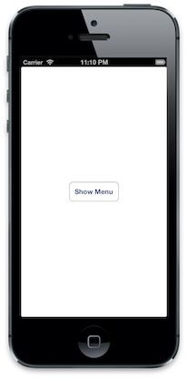
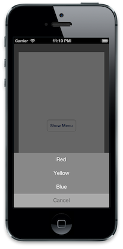

MBMenuController
================

MBMenuController is similar to UIActionSheet. It's something I rolled for a client project, although it has a few rough edges.

Dependencies:
============

You'll need the iOS 6 SDK. I haven't tested against earlier versions of iOS, but in theory, this should work with prior versions. 
MBButtonMenuController links uses CoreGraphics.framework and UIKit.framework, but you shouldn't have to add them to your projects. Xcode will have done that for you.

Relevant Files:
===============

You need the MBButtonMenuViewController.h and MBButtonMenuViewController.m files. The delegate is declared in the header.

Showing an MBButtonMenuViewController:
======================================

    /*
 
      After adding the two files to your Xcode project, 
      there are four steps to throwing up an 
      MBButtonMenuViewController on your iOS device or
      simulator screen:
    
    */

    // 0. Import MBButtonMenuViewController.h
    #import "MBButtonMenuViewController.h"

    // 1. Instantiate an instance with an array of titles
    NSArray *titles = @[@"Red", @"Yellow", @"Green"];
    MBButtonMenuViewController *menu = [[MBButtonMenuViewController alloc] initWithButtonTitles:titles];
    
    // 2. Wire up the delegate, to handle tap events
    [menu setDelegate:self];

    // 3. Show it in a view
    [menu showInView:[self view]];

Handling Button Taps:
=====================

There's a simple delegate API defined in MBButtonMenuViewController.h. It contains two methods, modeled after `UIActionSheet`. They are:

    buttonMenuViewController:buttonTappedAtIndex:
    buttonMenuViewControllerDidCancel:

When a button is tapped, the MBButtonMenuViewController first checks for the cancel button, and then fires `buttonMenuViewController:buttonTappedAtIndex:` if the button wasn't the cancel button. In either case, the delegate has the opportunity to properly handle the event. The simplest implementation would be to dismiss the menu.

Dismissing the Menu:
===================

     /*
     
     Dismissing the menu is really simple.
     Just use this one liner:

     */

     [menu hide];

Optional API:
=============

**Background Color:** You can set the color of the MBButtonMenuViewController by calling `setBackgroundColor:` and passing in a UIColor. This color is also used for the cancel button text.

**Cancel Button Index:** You can tell the MBButtonMenuViewController which button to treat as the cancel button by passing an NSUInteger to `setCancelButtonIndex:`. If the index is out of range, nothing happens. Passing an index that is between zero and the bounds of the button titles array will cause the index to be set and the menu to update.

How it works:
=============

You initialize MBButtonMenuViewController with an array of button titles, but you can set them later if you'd like. Calling `setButtonTitles:` will cause the menu to render itself again. `MBButtonMenuViewController` handles situations where there are too many buttons by using a scroll view. When there are too many buttons to squeeze down, the menu scrolls. 
To handle tap events, MBButtonMenuViewController employs a simple delegate, which contains two methods, as described above. 

When it is shown, the menu causes the "parent" view to shrink. To achieve this, MBButtonMenuController applies a transform to the view it's being shown "in" and installs itself above the target view, to provide the intended effect.
